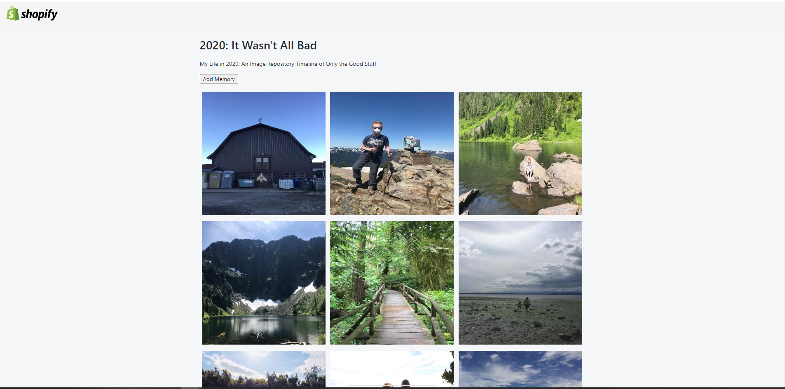

# Shopify-Developer-Internship-Challenge-2021

 

## Description
This is a Image Repository made for my Shopify Developer Internship application. Their instructions were pretty open ended so I made it into a timeline of only the good stuff from 2020. 
  
2020: It Wasn't All Bad

Link to deployed application: https://shopify-internship-challenge.herokuapp.com

## **Table of Contents**

1. [Usage](#usage)
2. [License](#license)
3. [Technologies](#technologies)
4. [Questions](#questions)
5. [Visuals](#visuals)
6. [Links](#links)

## **Usage**
Click on 'Add Memory' to upload an image to this page. Future development includes deleting, searching, as well as selling and buying images. 

## **License**
Copyright (c) 2020, Kayla Newlon. 

## **Technologies**
* React.js
* Polaris
* Cloudinary 
* WebPack
* Axios

## **Questions**
Contact me at kayla.b.newlon@gmail.com for any questions 

## **Visuals**

## **Links**
Repo: https://github.com/kbnewlon/shopify-developer-intern-challenge
 Deployed Application: https://shopify-internship-challenge.herokuapp.com
